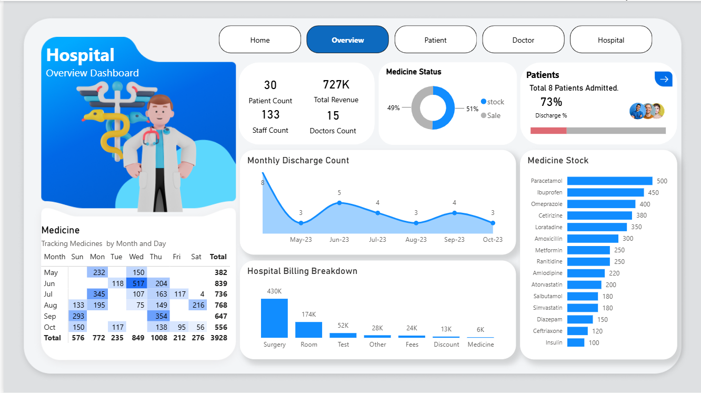
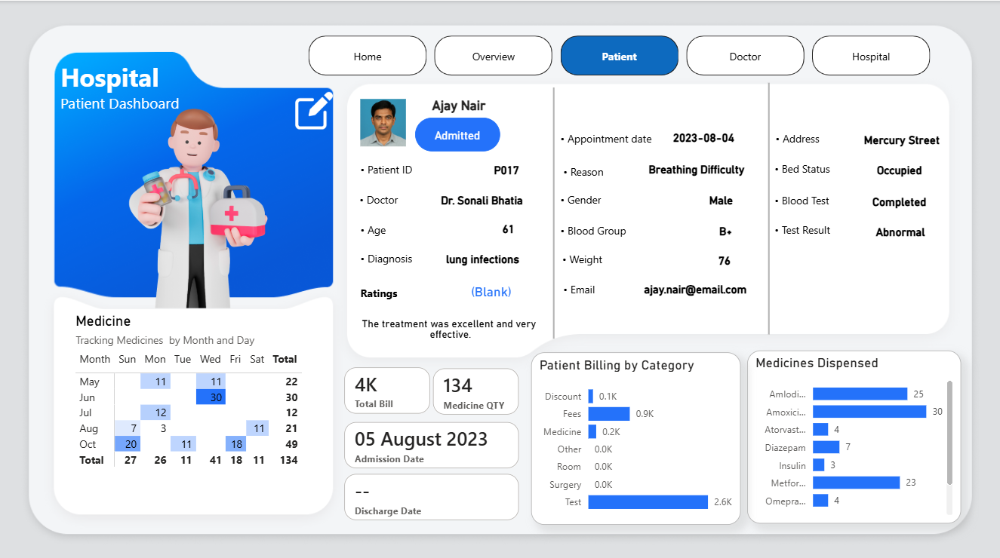
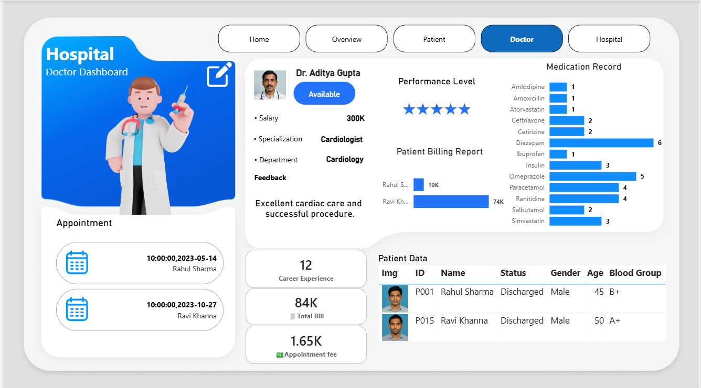
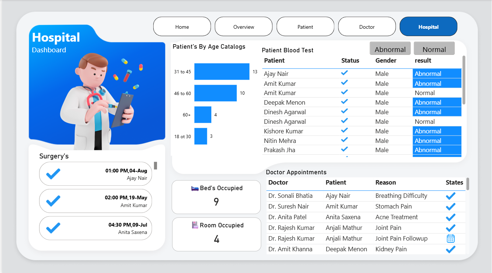

# 🏥 Hospital Management Analysis Dashboard

An interactive **Power BI dashboard** designed to analyze hospital operations, patient information, doctor performance, billing, medicines, appointments, and overall hospital activities.

This project provides a centralized view of hospital data through interactive dashboards, KPIs, charts, tables, and filters to support data-driven healthcare analysis and decision-making.

---

## 📊 Project Overview

The **Hospital Management Analysis Dashboard** provides insights into:

- 🧑‍⚕️ Patient information and medical details
- 👨‍⚕️ Doctor information and performance
- 💰 Hospital billing and revenue
- 💊 Medicine stock and dispensing
- 🏥 Bed and room occupancy
- 📅 Patient admissions and discharges
- 🧪 Blood test results
- 📆 Doctor appointments
- 🩺 Surgery and hospital operations

The dashboard is built using **Microsoft Power BI**, **Power Query**, **DAX**, and **Data Modeling**.

---

# 🎯 Project Objectives

- Monitor hospital performance using interactive KPIs.
- Analyze patient demographics and medical information.
- Track hospital revenue and billing categories.
- Monitor medicine stock and medicine usage.
- Analyze doctor appointments and patient interactions.
- Track bed and room occupancy.
- Analyze patient admission and discharge trends.
- Monitor patient blood test results.
- Support data-driven hospital management decisions.

---

# 🛠️ Tools & Technologies

| Tool / Technology | Purpose |
|---|---|
| **Microsoft Power BI** | Dashboard development and visualization |
| **Power Query** | Data cleaning and transformation |
| **DAX** | Measures and calculated columns |
| **Data Modeling** | Building relationships between tables |
| **Excel / CSV** | Source data |
| **Power BI Visuals** | Data analysis and reporting |

---

# 📊 Dashboard Pages

## 🏠 1. Overview Dashboard

The Overview Dashboard provides a summary of the overall hospital performance.

### Key Performance Indicators

- 👥 Patient Count
- 👨‍⚕️ Doctor Count
- 👩‍💼 Staff Count
- 💰 Total Revenue
- 🛏️ Bed Occupied
- 🚪 Room Occupied
- 💊 Medicine Quantity
- 📈 Discharge Percentage

### Key Analysis

- Medicine tracking by month and day
- Monthly discharge count
- Hospital billing breakdown
- Medicine stock analysis
- Medicine stock vs sales
- Patient admissions and discharges

### Dashboard Preview

---

## 🧑‍🤝‍🧑 2. Patient Dashboard

The Patient Dashboard provides detailed information about individual patients.

### Key Analysis

- Patient details
- Patient ID
- Age
- Gender
- Blood Group
- Diagnosis
- Admission Date
- Discharge Date
- Doctor Information
- Blood Test Results
- Bed Status
- Medicine Quantity
- Patient Billing

### Dashboard Preview

---

## 👨‍⚕️ 3. Doctor Dashboard

The Doctor Dashboard provides insights into doctor information and performance.

### Key Analysis

- Doctor appointments
- Patient information
- Doctor specialization
- Department
- Salary
- Career experience
- Patient billing
- Appointment fees
- Medication records
- Doctor feedback and performance

### Dashboard Preview

---

## 🏥 4. Hospital Operations Dashboard

The Hospital Operations Dashboard provides insights into daily hospital activities.

### Key Analysis

- Surgery schedules
- Doctor appointments
- Patient reasons
- Room occupancy
- Bed occupancy
- Patient age categories
- Patient blood test results
- Patient status
- Gender analysis

### Dashboard Preview

---

# 📈 Key Performance Indicators

| KPI | Description |
|---|---|
| **Patient Count** | Total number of patients |
| **Doctor Count** | Total number of doctors |
| **Staff Count** | Total hospital staff |
| **Total Revenue** | Total revenue generated by the hospital |
| **Bed Occupied** | Number of occupied beds |
| **Room Occupied** | Number of occupied rooms |
| **Medicine Quantity** | Total medicines dispensed |
| **Discharge %** | Percentage of discharged patients |
| **Appointment Fee** | Total appointment fees |
| **Total Bill** | Total patient billing amount |

---

# 💰 Hospital Billing Analysis

The dashboard analyzes hospital revenue across multiple billing categories:

- 🏥 Surgery
- 🛏️ Room
- 🧪 Test
- 💊 Medicine
- 🧾 Other Fees
- 💸 Discount

This helps hospital management understand the major contributors to total revenue.

---

# 💊 Medicine Analysis

The Medicine Analysis section provides insights into:

- Medicine stock levels
- Medicine sales
- Medicine usage by month
- Medicine usage by day
- Medicines dispensed to patients
- Medicine quantity tracking

---

# 🧑‍⚕️ Patient Analysis

The patient dashboard provides detailed information about:

- Patient demographics
- Age categories
- Gender
- Blood groups
- Diagnosis
- Admission and discharge dates
- Patient status
- Bed occupancy
- Blood test results

---

# 👨‍⚕️ Doctor Analysis

The Doctor Dashboard helps analyze:

- Doctor availability
- Doctor specialization
- Department
- Salary
- Career experience
- Patient appointments
- Patient billing
- Medication records
- Patient feedback

---

# 🏥 Hospital Operations Analysis

The hospital operations dashboard provides insights into:

- Surgery schedules
- Doctor appointments
- Patient reasons
- Room occupancy
- Bed occupancy
- Patient age categories
- Blood test results
- Patient status and gender

---

# 📊 Visualizations Used

- KPI Cards
- Bar Charts
- Line Charts
- Donut Charts
- Pie Charts
- Tables
- Matrix Visuals
- Slicers
- Cards
- Navigation Buttons
- Interactive Filters

---

# 🧮 Power BI Concepts Used

- Power Query Data Transformation
- Data Cleaning
- Data Modeling
- Relationships
- Calculated Columns
- DAX Measures
- KPI Creation
- Interactive Filters
- Drill-Down Analysis
- Dashboard Navigation

---

# 💡 Key Business Insights

The dashboard provides valuable insights into hospital operations:

- 📊 Hospital revenue can be analyzed across different billing categories.
- 💊 Medicine stock and medicine sales can be monitored effectively.
- 🛏️ Bed and room occupancy provide insights into hospital capacity utilization.
- 🧑‍⚕️ Patient data can be analyzed based on age, gender, diagnosis, and blood group.
- 👨‍⚕️ Doctor performance and appointment activity can be monitored.
- 🧪 Blood test results help analyze abnormal and normal patient test results.
- 📅 Admission and discharge trends help understand patient flow.
- 🏥 Hospital management can use the dashboard for data-driven decision-making.

---

│   └── Hospital_Dashboard_Project_Report.pdf
│
└── README.md
